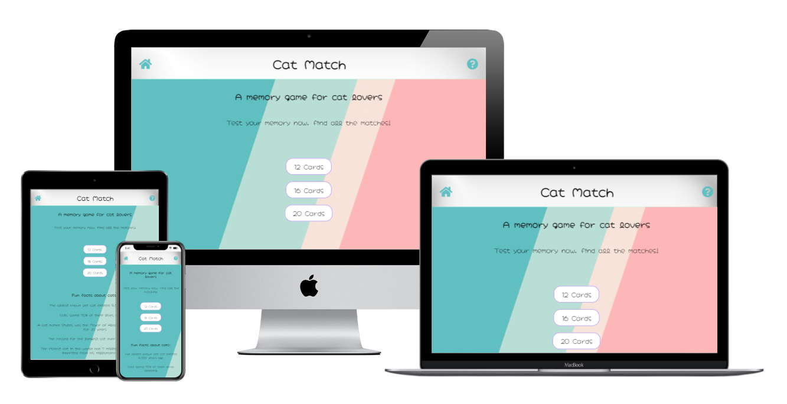

# Cat Match

[View deployed site here](https://paola62010.github.io/cat-match/index.html)

A videogame for cat lovers. The website features a memory game in which a group of cards are turned face down, with each turn two cards are flipped face up. If the images on the cards match, they will stay face up, otherwise they will flip face down again. The aim of the game is to find all the matches. 

This videogame is good for children, but adults can find it challenging and stimulating also. 

## UX
---

### The ideal client for this website: 

- Speaks English.
- Likes memory/concentration games.
- Loves cats. 

### Visitors to this website are searching for: 

- A memory game to test their memory
- A memory game for their children
- A simple and relaxing game to play, maybe on a coffee break.  

### User stories

1. As a new visitor to the website, I want to be able to navigate the website easily and find what I need efficiently.
2. As a new visitor to the website I can see that the information is laid out clearly and I can navigate the website from different devices (desktop, tablet or phone).
3. As a new visitor, I want to read the game rules.
4. As a new or returning visitor, I want to be able to select the difficulty of the game by choosing the number of cards.
5. As a new or returning visitor, I want the possibility to play music during a game. 
6. As a new or returning visitor, I want to be able to start a new game as soon as one is complete.
7. As a new or returning visitor, I want to be able to start a nee game even if the current one is not complete. 
8. As a returning visitor, I want the possibility to contact the videogame creator.

### Wireframe mockups

[Desktop Mockups](assets/readme-testing-images/desktop-wireframes)

[Tablet Mockups](assets/readme-testing-images/tablet-wireframes)

[Mobile Mockups](assets/readme-testing-images/mobile-wireframes)

## Features
---

The header on each page features the game logo, the home icon and the question mark icon. Both the logo and home icon redirect the visitor back to the home page. The question mark icon opens a popup window with the game rules. 
The footer of each page features a "Contact Us" link that opens a popup window with a form that the visitor can fill out. 

#### Home Page 

The home page is divided into two main parts. The top part includes a call to action that invites the user to test their memory and start a game. Just below, the user can find three buttons that allow to select the number of cards they wish to have for the game. The higher the number, the more difficult the game will be. 
The second part of the page is dedicated to a list a fun facts about cats. 

#### 12 Cards Page 

When users click on the "12 Cards" button in the home page, they will be redirected on the 12 Cards Page. This page features a card board of 12 cards that are facing down. Users will be able to flip 2 cards each turn. If the images on the cards match, the cards will remain face up, otherwise they will flip back down. Once all the matches have been found, a popup window appears to congratulate the user. The popup window contains a "Play again" button to start a new game. 
Just above the card board, users will find two buttons. On the left a button to start a new game, this can be used also when the game is not complete. On the right there is an audio icon that allows the user to turn the music on and off. Music will play in a loop. 

#### 16 Cards Page 

When users click on the "16 Cards" button in the home page, they will be redirected on the 16 Cards Page. This page has the same features of the 12 Cards Page, with the only difference being the number of cards, 16 cards on this page.

#### 20 Cards Page 

When users click on the "20 Cards" button in the home page, they will be redirected on the 20 Cards Page. This page has the same features of the 12 Cards Page, with the only difference being the number of cards, 20 cards on this page.

### Existing Features

- Header logo - This exists on every page and when clicked it redirects the user to the home page.
- The home icon - This exists on every page, in the header, and when clicked it redirects the user to the home page.
- The question mark icon - This exists on every page, in the header, and when clicked it opens a popup window that contains the game rules. 
- Footer with "Contact Us" link - This exists on every page and when clicked it opens a popup window that contains a form that the user can fill out to contact the game creator. 
- Buttons to select number of cards - These exist on the home page an allow the user to select the number of cards for the game (12, 16 or 20). 
- Fun Facts section - This is located on the home page and lists a series of fun facts about cats. 
- Card board - This is present in the 12 Cards Page, 16 Cards Page and 20 Cards Page. All cards are facing down until the user clicks on them. Two cars can be flipped each turn. 
- New Game button - This is present in the 12 Cards Page, 16 Cards Page and 20 Cards Page. It allows the user to start a new game. 
- Audio button - This is present in the 12 Cards Page, 16 Cards Page and 20 Cards Page. It allows the user to start or stop the music during the game. 

### Features to Implement in future

- A fully working contact form with the ability to store the users' messages and details. 
- A timer to be included above the board to show the user how much time each game is taking. 
- A score page to list the users' names and best scores (game completed in the shortest time). 

## Technologies Used

- This project uses HTML, CSS and JavaScript programming languages.
- Google Fonts: 
This project uses Google Fonts to style the text for the website. 
- Font Awesome:
This project uses Font Awesome for the icons used in the header, footer and audio icon.

## Testing

Testing information can be found in [TESTING.md]() file.

## Deployment

This project was developed using VS Code editor.

### Github Pages

The project was deployed to Github Pages by following these steps: 

1. Log into Github and locate the repository for this project: [Paola62010/cat-match](https://github.com/Paola62010/cat-match)
2. On the top navigation bar click on _Settings_.
3. On the left side there is a menu, locate and click on _Pages_. 
4. Under _Source_, select branch _Master_ from the dropdown menu and click on _Save_.  
5. The page is refreshed automatically and a link for the published page is generated, https://paola62010.github.io/cat-match

### Cloning the repository

To clone the repository, follow these steps: 

1. Log into Github and locate the repository for this project: [Paola62010/cat-match](https://github.com/Paola62010/cat-match)
2. Above the list of files, click on _Code_, a dropdown menu is presented with different options.
3. In the Clone with HTTPs section, copy the clone URL for the repository.
4. In your local IDE open the terminal.
5. Change the current working directory to the location where you want the cloned directory to be. 
6. Type _git clone_, and then paste the URL copied earlier (step 3).
7. Press Enter to create your local clone.

Additional information on how to clone a Github repository can be found [here](https://docs.github.com/en/github/creating-cloning-and-archiving-repositories/cloning-a-repository).

## Credits 

### Content

The content for the fun facts section in the home page was created using the following site:

https://www.purina.co.uk/articles/cats/behaviour/common-questions/fun-facts-about-cats

### Media 

- The cats images used for the cards were taken from [Adobe Stock](https://stock.adobe.com/ie)
- The question mark image used for the back of the cards was obtained from [Pixabay](https://pixabay.com/). Credit to the image author, Gerd Altmann.
- The background image used on all pages was obtained from [Unsplashed](https://unsplash.com/). Credit to the author, Gradienta. 
- The audio for the game music was obtained from [HookSounds](https://www.hooksounds.com/)

### Acknowledgements

Thank you to Code Institute and the tutors for putting up with my questions and pointing me in the right direction.  