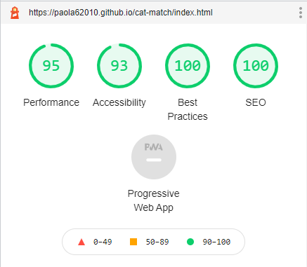
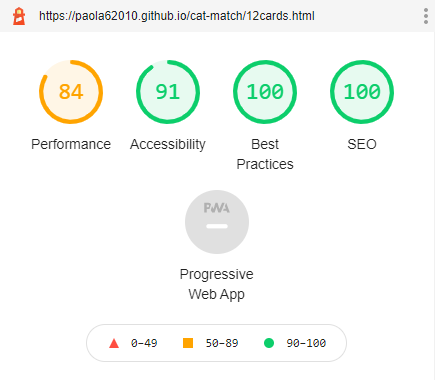
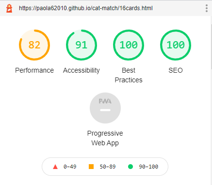
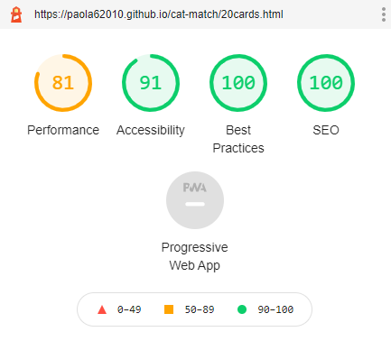

# Cat Match - Testing Details

[Main README.md file](README.md)

[Deployed site](https://paola62010.github.io/cat-match/index.html)

The following validators were used to check the validity of the website code:

[W3C Makup Validation Service](https://validator.w3.org/)

[W3C CSS Valiation Service](http://jigsaw.w3.org/css-validator/)

No errors are returned. 

For the HTML code, there is a warning message on the 12 Cards, 16 Cards and 20 Cards page. The warning suggests to use a heading for the section that includes the cards board. I feel that this is not needed in this case. 
For the CSS code, there are 2 warnings, one being the use of -webkit-backface-visibility (which I needed for Safari and IOS) and the other being the value "auto" used for pointer-events. 

## User Stories Testing 

User stories can be found in the UX section in the [README.md file](README.md)

1. As a new visitor to the website, I want to be able to navigate the website easily and find what I need efficiently.

    i. The site has a very simple design and allows the user to navigate it easily. 

    ii. In all pages a home button is present in the header, this redirects the user back to the home page as it would be expected.

    iii. The game logo also redirects the user to the home page.  

2. As a new visitor to the website I can see that the information is laid out clearly and I can navigate the website from different devices (desktop, tablet or phone).

    i. The information is clearly laid out and easy to find thanks to the simple design of the site. 

    ii. The webisite is responsive and can be viewed by the visitor on different size screens.

3. As a new visitor, I want to read the game rules.

    i. On each page, in the header, there is a question mark icon. By clicking on the icon, a popup window appears showing the user the game rules. 

4. As a new or returning visitor, I want to be able to select the difficulty of the game by choosing the number of cards.

    i. In the home page the user will find three buttons 

5. As a new or returning visitor, I want the possibility to play music during a game. 

    i. In the 12 Cards, 16 Cards and 20 Cards pages, there is a audio icon that the user can use to start the music.

    ii. By clicking on the auio icon, the music will start or it will stop if it was playing. The icon changes to show the user when it's on or off. 

6. As a new or returning visitor, I want to be able to start a new game as soon as one is complete.

    i. When all the matches have been found, a popup window appears to congratulate the user. The popup includes a button to allow the user to start a new game. 

    ii. The user can also start a new game by closing the popup and clicking on the "New Game" button located just above the cards board. 

7. As a new or returning visitor, I want to be able to start a new game even if the current one is not complete. 

    i. The user can start a new game even if the current one is not complete by clicking on the "New Game" button located above the cards board. 

8. As a returning visitor, I want the possibility to contact the videogame creator.

    i. The footer on each page features a "Contact Us" link. When clicking on it, a popup window apears. The popup window includes a form for the user to fill out. 

    ii. When The form is complete, the user can click on the "Send" button. A thank you message will be returned in the same popup window. 

## Manual Testing 

### Home Page 

1. Header

    i. Click on the game logo and verify that it redirects to the home page. 

    ii. Hover over the home and question mark icons and verify that the color of the icons changes. 

    iii. Click on the home icon and verify that it redirects to the home page. 

    iv. Click on the question mark icon and verify that the modal popup appears and content is visible. 

    v. Click on the X on the top right corner of the modal popup to verify that the popup window closes. 

2. Card number selection 

    i. Hover over the 3 buttons (12 Cards, 16 Cards and 20 Cards) and verify that the color changes.

    ii. Click on each button and verify that it redirects to the correct page. 

3. Footer 

    i. Hover over the "Contact Us" link and verify that it changes color. 

    ii. Click on the link and verify that the modal popup appears and the contact form is visible. 

    iii. Type in the input and textarea fields and verify that the background color changes. 

    iv. Hover over the "send" button and verify that the background color changes.

    v. Try submitting the form without any of the required values and verify that an error appears. All fields are required. 

    vi. Try submitting the form with an invalid email format and verify that an error appears. 

    vii. Fill out all required fields and click on the "Send" button and verify that a thank you message appears in the same window. 

    viii. Click on the X on the top right corner of the popup window and verify that the window closes. 

4. Checked the functionality on different size screens, content is responsive and clearly visible on all screens.

### 12 Cards Page 

1. Header

    i. Follow the same steps highlighted for the home page. 

2. Card board 

    i. Click on two cards and verify that the cards flip and the images are shown. 

    ii. Click on a third card after the first two and verify that the third card is not flipped. Only two cards can be flipped each turn. 

    iii. Click on the same card twice and verify that nothing happens. 

    iv. Click to flip one card and hold and verify that the scale effect shows. 

    v. When the card flips verify that the 3d effect works. 

    v. When flipping two cards and the images on them match, verify that the cards remain face up.

    vi. When flipping two cards and the images do not match, verify that the cards are flipped back down. 

    vii. When all matches have been found, verify that a modal popup appears to congratulate the user. 

    viii. When clicking on the "Play again" button on the modal popup, verify that a new game starts and cards are in a randomized position. 

    ix. When clicking on the X on the top right corner of the modal popup, verify that the window closes. 

3. New Game and Audio buttons

    i. Click on the audio icon and verify that the music starts and the icon changes. 

    ii. Click on the audio icon when music is playing and verify that the music stops and the icon changes back to a muted audio icon.

    iii. when music is playing, verify that it plays in a loop. 

    iv. Start a game and mid game click on the "New Game" button. Verify that a new game is started and cards are in a randomized position. 

 4. Footer 

    i. Follow the same steps highlighted in the home page. 

### 16 Cards Page 

1. Header

    i. Follow the same steps highlighted for the home page. 

2. Card board 

    i. Follow the same steps highlighted for the 12 Cards page. 

3. New Game and Audio buttons

    i. Follow the same steps highlighted for the 12 Cards page.

4. Footer 

    i. Follow the same steps highlighted in the home page.

### 20 Cards Page 

1. Header

    i. Follow the same steps highlighted for the home page. 

2. Card board 

    i. Follow the same steps highlighted for the 12 Cards page. 

3. New Game and Audio buttons

    i. Follow the same steps highlighted for the 12 Cards page.

4. Footer 

    i. Follow the same steps highlighted in the home page.

## Additional Testing 

- Site was tested in different browsers and works nicely in all of them: Google Chrome, Safari, Firefox, Microsoft Edge.

- Used different devices for testing including: MacBook Pro, iPad, iPhone 11 Pro and HP Pavillion Notebook. Latest operating system installed on all devices. 

- Extensive use of Google Chrome DevTools to test site perormance and responsiveness. 

- Use of Lighthouse feature on Google Chrome DevTools to test the site performance. Following results were achieved:

    - Home Page 

    

    - 12 Cards Page

    

    - 16 Cards Page

    

    - 20 Cards Page

    